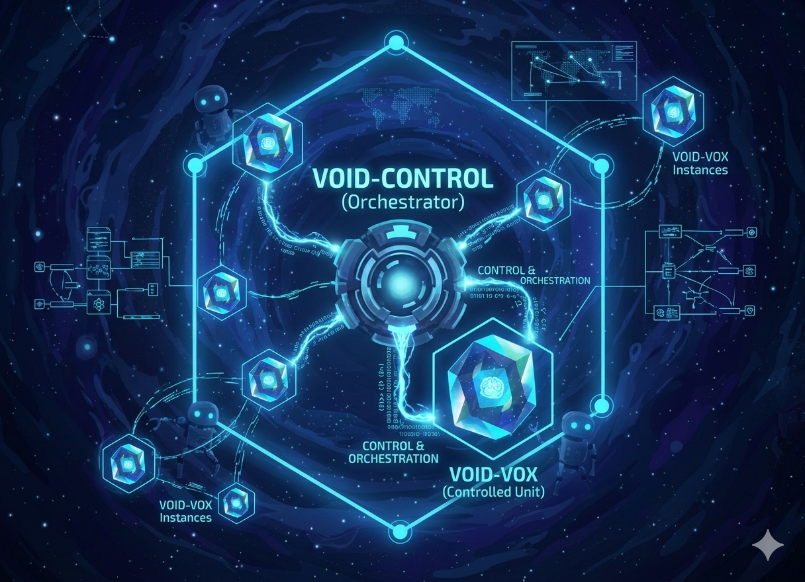

# void-control

Control-plane orchestration for `void-box` runtime execution.



## Demo

[](docs/assets/void-control-demo.mp4)

Click the preview above for the full-quality MP4, or use the direct file link: [void-control demo video](docs/assets/void-control-demo.mp4).

## Swarm Execution Demo

[](docs/assets/void-control-swarm-demo.mp4)

This recording shows the canonical first-release flow:

- a live 3-agent swarm execution
- graph-first orchestration inspection
- right-side metrics and event inspection
- runtime drill-down through `Open Runtime Graph`

Direct link: [void-control swarm execution demo](docs/assets/void-control-swarm-demo.mp4).

## Release

- First public release target: `v0.0.1`
- Release artifacts are published through GitHub Releases
- Supported `void-box` baseline for `v0.0.1`: `void-box` `v0.1.1` or an equivalent validated production build
- Release process and compatibility gate details: [docs/release-process.md](docs/release-process.md)

## What It Is

`void-control` is the control-plane side of the stack:

- launches and manages runtime work on `void-box`
- normalizes runtime payloads into a stable control-plane contract
- plans and tracks orchestration executions across multiple candidates
- persists execution, event, candidate, and message-box state
- provides terminal-first and graph-first operator UX
- enforces runtime contract compatibility with `void-box`

## Orchestration Strategies

`void-control` should be understood as a host for orchestration strategies, not
as a single-purpose swarm console.

Current direction:

- `swarm`: first implemented orchestration strategy
- `supervision`: implemented orchestrator-worker strategy

Shared control-plane primitives across strategies:

- execution specs and policies
- candidate planning and reduction
- persisted control-plane events
- message-box / MCP-backed collaboration state
- graph-first execution inspection in the UI

The strategy changes the orchestration semantics. It should not require a
different product surface or a different backend contract family.

## Documentation

- Architecture: [docs/architecture.md](docs/architecture.md)
- Contributor and agent guide: [AGENTS.md](AGENTS.md)
- Release and compatibility process: [docs/release-process.md](docs/release-process.md)
- Execution examples and live swarm workflow: [examples/README.md](examples/README.md)

## Project Components

- `spec/`: Runtime and orchestration contracts.
- `src/`: Rust orchestration client/runtime normalization logic.
- `tests/`: Contract and compatibility tests.
- `web/void-control-ux/`: React operator dashboard (graph + inspector).

## Quick Start

### 1) Start `void-box` daemon

```bash
cargo run --bin voidbox -- serve --listen 127.0.0.1:43100
```

### 2) Run `void-control` tests

```bash
cargo test
cargo test --features serde
```

### 3) Run live daemon contract gate

```bash
VOID_BOX_BASE_URL=http://127.0.0.1:43100 \
cargo test --features serde --test void_box_contract -- --ignored --nocapture
```

### 4) Start graph dashboard

```bash
cd web/void-control-ux
npm install
VITE_VOID_BOX_BASE_URL=http://127.0.0.1:43100 npm run dev
```

### 5) Launch from YAML editor/upload (bridge)

Run bridge mode in another terminal:

```bash
cargo run --features serde --bin voidctl -- serve
```

Then start UI with bridge URL:

```bash
cd web/void-control-ux
VITE_VOID_BOX_BASE_URL=http://127.0.0.1:43100 \
VITE_VOID_CONTROL_BASE_URL=http://127.0.0.1:43210 \
npm run dev
```

### 6) Run the canonical live swarm test

Use the three-candidate swarm as the default validation path:

```bash
curl -sS -X POST http://127.0.0.1:43210/v1/executions \
  -H 'Content-Type: text/yaml' \
  --data-binary @examples/swarm-transform-optimization-3way.yaml
```

`examples/swarm-transform-optimization.yaml` remains available as the wider
eight-candidate stress case, but it is less reliable for routine validation.

This is also the canonical first-release orchestration workflow:

- load a top-level orchestration YAML
- launch through the bridge or UI
- inspect the execution graph, inspector, and event stream
- follow candidate metrics and `leader` / `broadcast` collaboration events

### 7) Run the supervision example

Use the checked-in supervision example to exercise the flat
orchestrator-worker path:

```bash
curl -sS -X POST http://127.0.0.1:43210/v1/executions \
  -H 'Content-Type: text/yaml' \
  --data-binary @examples/supervision-transform-review.yaml
```

Current v1 supervision contract:

- workers still run a normal runtime template on `void-box`
- approval is reducer-driven in `void-control`
- worker output must include `metrics.approved`
- the bundled supervision worker template appends that metric after the measured
  benchmark run

## Development

Rust validation:

```bash
cargo fmt --all -- --check
cargo clippy --all-targets --all-features -- -D warnings
cargo test
cargo test --features serde
RUSTDOCFLAGS="-D warnings" cargo doc --no-deps --all-features
```

UI validation:

```bash
cd web/void-control-ux
npm ci
npm run build
```

Optional local pre-commit setup:

```bash
pip install pre-commit
pre-commit install
pre-commit run --all-files
```

## Terminal Console

```bash
cargo run --features serde --bin voidctl
```

## Notes

- Dashboard uses daemon APIs (`/v1/runs`, `/v1/runs/{id}/events`, `/v1/runs/{id}/stages`, `/v1/runs/{id}/telemetry`).
- `+ Launch Spec` supports:
  - orchestration YAML through bridge execution create (`POST /v1/executions`)
  - raw runtime spec upload through bridge launch (`POST /v1/launch`)
  - path-only fallback launch (`POST /v1/runs`) when no spec text is provided
